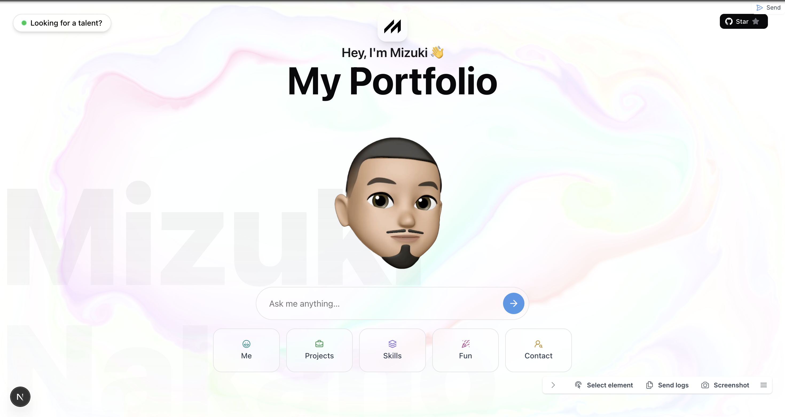

# Hi, my name is Mizuki Nakano 🤖✨

**Traditional portfolios are limiting.**
So I built my AI-powered portfolio.

Static resumes can't capture my dynamic experience and growth.
They can't adapt to what *you* specifically want to know about me.
My portfolio becomes exactly what you're interested in — designed around your specific needs.

## 👇 What can you ask?

- 🧠 **Tech recruiter?** Ask about my data engineering experience & results
- 💻 **Fellow engineer?** Dive into my technical stack & problem-solving approach
- 🧑‍🤝‍🧑 **Friend or colleague?** See what I've been working on lately

---

This isn't just a portfolio.
It's a **conversation that adapts to who you are and what you need to know**.

Whether you're evaluating me for a role, curious about my projects, or just want to connect, my AI avatar will give you exactly the information that matters to you.

➡️ **Try it now:** [https://mizuki-portfolio.vercel.app](https://mizuki-portfolio.vercel.app)
*What will you ask?*

---

#### 🔖 Tags

`#AIPortfolio` `#DataEngineering` `#DigitalResume` `#JobSearch` `#TechInnovation` `#WebDevelopment` `#FutureTech`
